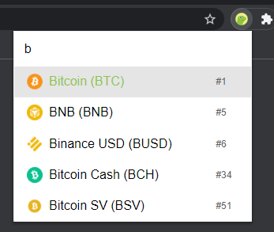

# Easy Crypto Search Extension

Chrome extension for quickly looking up cryptocurrencies on CoinMarketCap or CoinGecko.

## Overview

This extension allows you to quickly look up cryptocurrencies on CoinMarketCap or CoinGecko. Open the extension and start typing, confirming with either Enter or mouse click opens the page in a new tab.

You can choose between CoinMarketCap and CoinGecko by clicking the icon in the top right corner.



## Installation

In Chrome, load the `src` folder as an unpacked extension.

`Extensions -> Enable developer mode -> Load unpacked -> Select src folder`

You can also set up a keybind to open this extension faster. In Chrome, go to `Settings -> Extensions -> Keyboard shortcuts -> Set a shortcut for Easy Crypto Search`.

## Choose between CoinMarketCap and CoinGecko

Edit the `src/config.js` file to change the default search engine.
Comment out one of the two lines and uncomment the other.

```javascript
export default {
  web: "https://www.coingecko.com/en/coins", // uncomment to use coingecko
  // web: "https://coinmarketcap.com/currencies", // uncomment to use coinmarketcap
};
```

Save the file and reload the extension in `Chrome -> Extensions -> Reload`.
